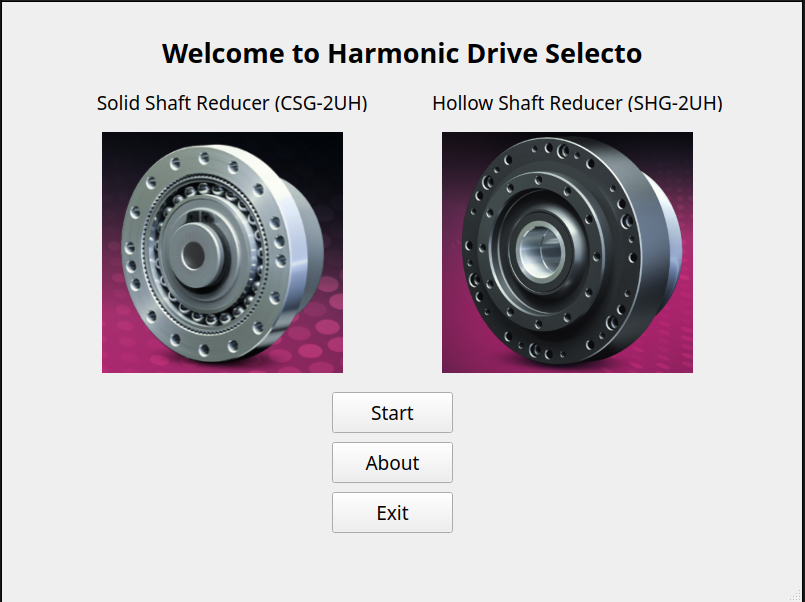

# Harmonic Drive Selector
This is a Harmonic Drive app built with Qt5 that allows engineers to easily select the appropriate drive for their application by inputting torque and angular speed data for their load.

## Screenshots


## Installation

1. **Clone the repository**  

```bash
git clone https://github.com/AimanHaidair/harmonic-drive-selector.git
cd harmonic-drive-selector
```

2. **add the requirements of the  project**
due to uv lock user to install pyqt5-qt5 with pyqt5 windows show issue when use uvlock.
#####Linux and MacOS
```bash
uv sync
```
#####Windows
```cmd
# source your enviroment first if you want
pip install -r requirements-win-txt
```

3. **now you have two options to run:**
    - **option 1:** using directly the main.py
    ##### Linux and MacOs
    ```bash
    uv run main.py
    ```
    ##### Windows
    ```cmd
    python -m main
    ```

    - **option 2:** building the project and get one exeutable file using pyinstaller

        1. install pyinstall in your vevn

        ```bash
            uv add pyinstall
        ```
        2. run this command

            ##### Linux:
            ```bash
            .venv/bin/python -m PyInstaller --onefile main.py
            ```

            ##### Windows:
            ```powershell
            python -m PyInstaller --onefile --windowed main.py
            ```

        this will create dist folder contain the executable


