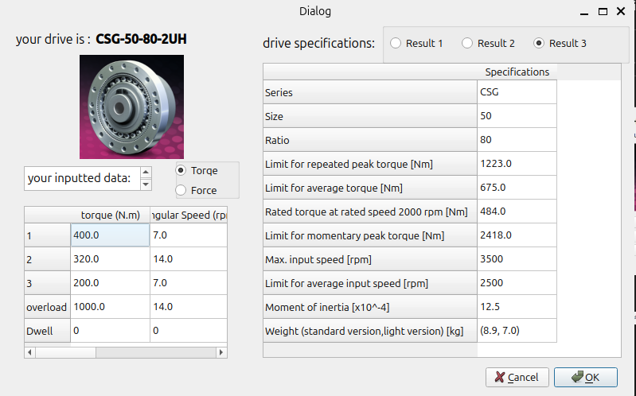

# Harmonic Drive Selector

This is a Harmonic Drive app built with Qt5 that allows engineers to easily select the appropriate drive for their application by inputting torque, angular speed, and tilting forces data for their load.

> **Note:** This program is fully based on the instructions from the *[Harmonic Drive Gears](https://harmonicdrive.de/en/home)*.

---

## Screenshots

**Main Window:**  


**Results:**  


---

## Installation

### 1. Clone the Repository

```bash
git clone https://github.com/AimanHaidair/harmonic-drive-selector.git
cd harmonic-drive-selector
```

### 2. Install Requirements

> **Note:**  
> On Linux/MacOS, use `uv sync`.  
> On Windows, use `pip install -r requirements-win.txt`.  
> (Windows users: PyQt5-Qt5 may have issues with uv lock.)

#### Linux/MacOS

```bash
uv sync
```

#### Windows

```cmd
pip install -r requirements-win.txt
```

---

## Usage

### Option 1: Run Directly

#### Linux/MacOS

```bash
uv run main.py
```

#### Windows

```cmd
python -m main
```

### Option 2: Build Executable with PyInstaller

1. Install PyInstaller in your environment:

    ```bash
    uv add pyinstaller
    ```

2. Build the executable:

    **Linux:**
    ```bash
    .venv/bin/python -m PyInstaller --onefile main.py
    ```

    **Windows:**
    ```powershell
    python -m PyInstaller --onefile --windowed main.py
    ```

The executable will be in the `dist` folder.

---


